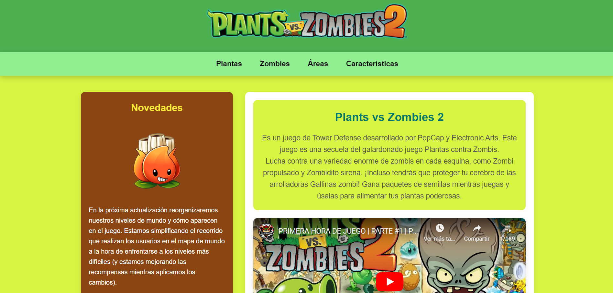
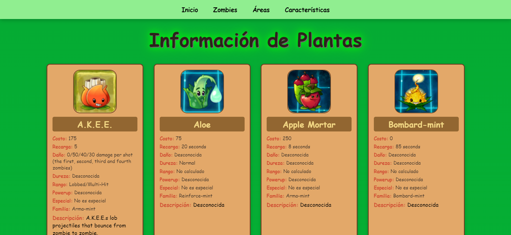
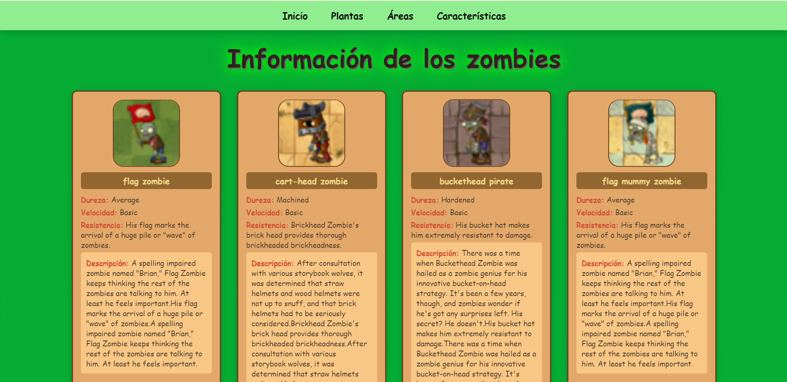
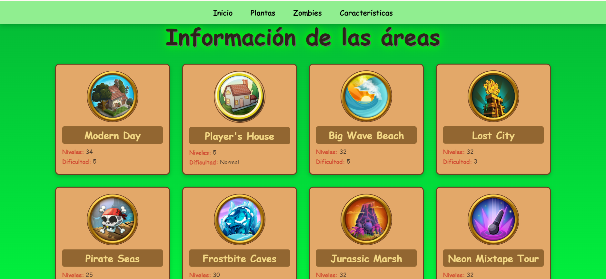
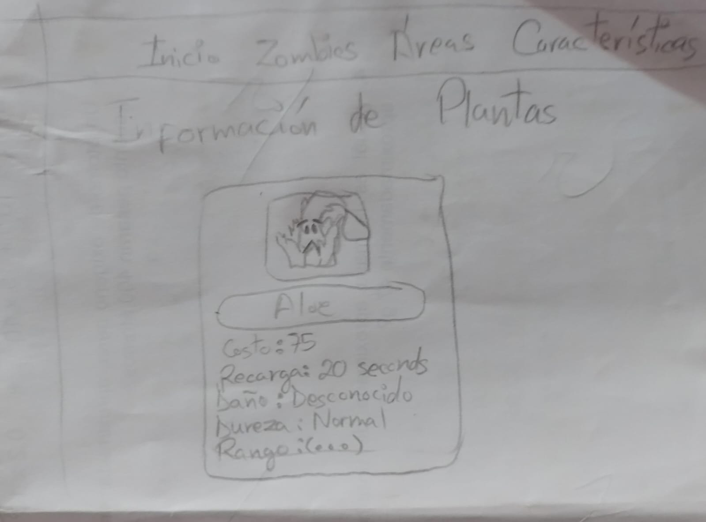
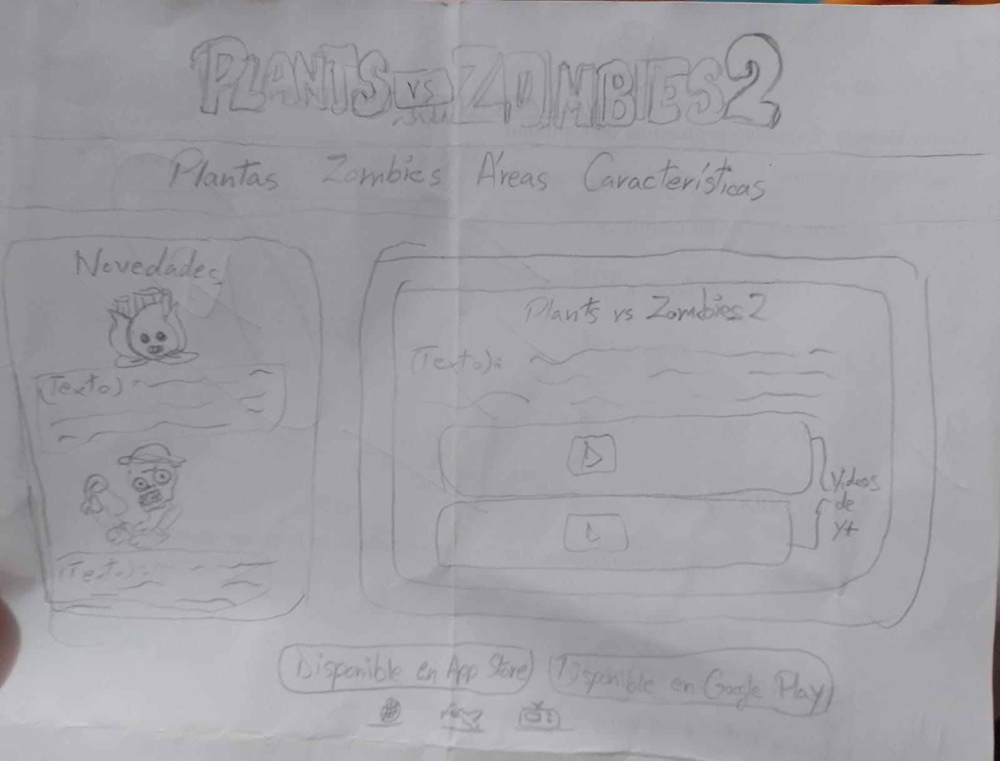
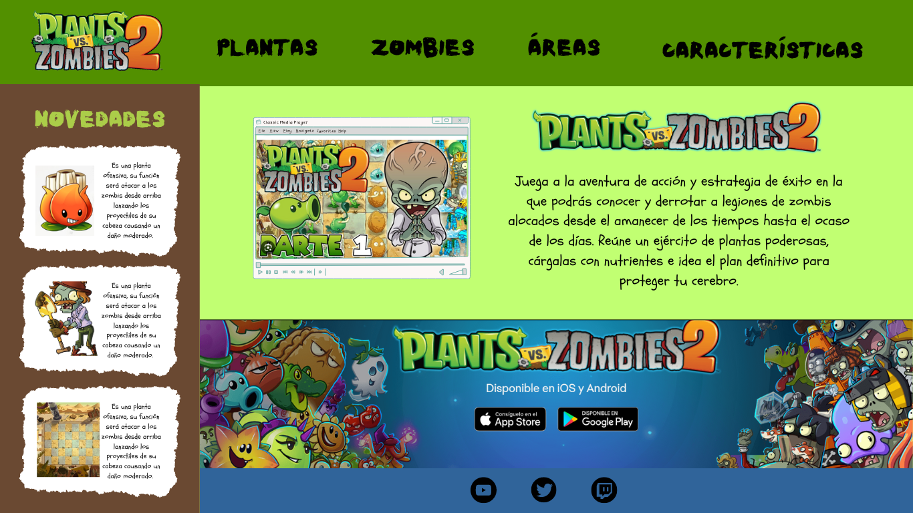

# Plantas vs Zombies Web 🌻🧟

Bienvenido al repositorio del proyecto **"Plantas vs Zombies🌻🧟"**. Este proyecto es una página web dedicada a la popular serie de videojuegos "Plantas vs Zombies 🌻🧟", desarrollada para proporcionar información, recursos y una experiencia interactiva para los fanáticos del juego y usuarios interesados.

## 📌 Descripción

### La página web incluye:

- 🌻🧟 Información detallada sobre el juego "Plantas vs Zombies".
- 📱 Videos sobre el juego.
- 🔗 Links de descarga para cualquier dispositivo. 
#### Página de plantas

#### Página de zombies

#### Página de áreas

## 📌 Uso

- Página de inicio: Muestra una visión general del juego, enlaces a otras secciones y videos sobre el juego.
- **Página de plantas 🌱:** Muestra información de las plantas del juego.
- **Página de zombies 🧟‍♀️:** Muestra información de los zombies del juego.
- **Página de áreas 🏞️:** Muestra información de las áreas del juego.

## 📌 Tecnologías Usadas

- **HTML**: Estructura de la página web.
- **CSS**: Estilo y diseño de la página.
- **JavaScript**: Interactividad y funciones dinámicas.
- **jQuery**: Librería para manipulación del DOM y eventos.

## Diseño de la Interfaz de Usuario
### Prototipo de baja fidelidad 🌞

### Prototipo de alta fidelidad 🌞

## 📌 Créditos

**Desarrollador Principal:** Plan Z 😎 
**Frontend:** Adriana 💻 
**Backend:** Noelia y Claudia 💻 
